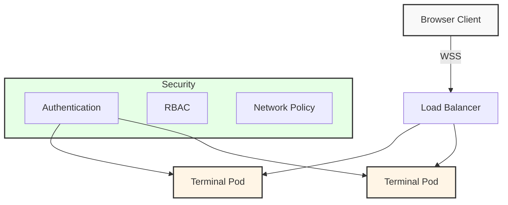

# 🖥️ Cloud Terminal Project

> A memory-safe cloud terminal emulator built with Ghostty and Zig. The Mac build is an absolute delight.
> Go here for more details: [Ghostty](https://ghostty.org/) Dig the repo [here](https://github.com/ghostty-org/ghostty)

<details>
<summary>Table of Contents</summary>

- [Overview](#overview)
- [Architecture](#architecture)
- [Prerequisites](#prerequisites)
- [Deployment](#deployment)
  - [AWS](#aws)
  - [GCP](#gcp)
  - [Azure](#azure)
- [Security](#security)
- [Contributing](#contributing)
</details>

## 🎯 Overview

This project implements a secure, cloud-native terminal emulator using:
- 🛡️ Memory-safe Zig implementation
- 🐋 Container-based isolation 
- 🌐 WebAssembly for client-side rendering (TBD)
- 🔒 End-to-end encryption  (TBD)

## 🏗️ Architecture



## 📋 Prerequisites

- Zig 0.13.0+
- Docker
- Kubernetes 1.27+
- Terraform 1.0+

## 🚀 Deployment

### Infrastructure

```dockerfile
FROM debian:bullseye-slim as builder

# Install dependencies
RUN apt-get update && apt-get install -y \
    build-essential \
    curl \
    git \
    xz-utils \
    cmake \
    pkg-config \
    libxcb-randr0-dev \
    libxcb-xfixes0-dev \
    libxcb-render0-dev \
    libxcb-shape0-dev \
    libxcb-xkb-dev \
    libfontconfig-dev \
    && rm -rf /var/lib/apt/lists/*

# Install Zig
RUN curl -L https://ziglang.org/download/0.13.0/zig-linux-x86_64-0.13.0.tar.xz | tar -xJ
ENV PATH="/zig-linux-x86_64-0.13.0:${PATH}"

# Build Ghostty
WORKDIR /build
RUN git clone https://github.com/ghostty-org/ghostty.git && \
    cd ghostty && \
    zig build -Doptimize=ReleaseSafe

# Final image
FROM debian:bullseye-slim
COPY --from=builder /build/ghostty/zig-out/bin/ghostty /usr/local/bin/
WORKDIR /app
COPY . .
CMD ["./start.sh"]
```

### Cloud Provider Configurations

<details>
<summary>📦 AWS Configuration</summary>

```hcl
provider "aws" {
  region = var.aws_region
}

module "vpc" {
  source = "terraform-aws-modules/vpc/aws"
  
  name = "terminal-vpc"
  cidr = "10.0.0.0/16"
  
  azs             = ["${var.aws_region}a", "${var.aws_region}b"]
  private_subnets = ["10.0.1.0/24", "10.0.2.0/24"]
  public_subnets  = ["10.0.101.0/24", "10.0.102.0/24"]
  
  enable_nat_gateway = true
}

module "eks" {
  source  = "terraform-aws-modules/eks/aws"
  version = "~> 19.0"
  
  cluster_name    = "terminal-cluster"
  cluster_version = "1.27"
  
  vpc_id     = module.vpc.vpc_id
  subnet_ids = module.vpc.private_subnets
  
  eks_managed_node_groups = {
    terminal = {
      min_size     = 1
      max_size     = 10
      desired_size = 2
      instance_types = ["t3.medium"]
    }
  }
}
```
</details>

<details>
<summary>🌐 GCP Configuration</summary>

```hcl
provider "google" {
  project = var.project_id
  region  = var.region
}

resource "google_service_account" "gke_sa" {
  account_id   = "gke-service-account"
  display_name = "GKE Service Account"
}

resource "google_container_cluster" "primary" {
  name     = "terminal-cluster"
  location = var.region
  
  initial_node_count = 1
  
  workload_identity_config {
    workload_pool = "${var.project_id}.svc.id.goog"
  }

  node_config {
    machine_type = "e2-medium"
    
    workload_metadata_config {
      mode = "GKE_METADATA"
    }

    service_account = google_service_account.gke_sa.email
  }
}

resource "google_project_iam_binding" "gke_sa_binding" {
  project = var.project_id
  role    = "roles/container.developer"
  members = ["serviceAccount:${google_service_account.gke_sa.email}"]
}

resource "google_service_account_iam_binding" "workload_identity_binding" {
  service_account_id = google_service_account.gke_sa.name
  role               = "roles/iam.workloadIdentityUser"
  members = [
    "serviceAccount:${var.project_id}.svc.id.goog[default/default]"
  ]
}

resource "google_project_iam_binding" "registry_binding" {
  project = var.project_id
  role    = "roles/storage.objectViewer"
  members = ["serviceAccount:${google_service_account.gke_sa.email}"]
}
```
</details>

<details>
<summary>☁️ Azure Configuration</summary>

```hcl
provider "azurerm" {
  features {}
}

resource "azurerm_resource_group" "terminal" {
  name     = "terminal-resources"
  location = var.location
}

resource "azurerm_kubernetes_cluster" "terminal" {
  name                = "terminal-aks"
  location            = azurerm_resource_group.terminal.location
  resource_group_name = azurerm_resource_group.terminal.name
  dns_prefix          = "terminal"

  default_node_pool {
    name       = "default"
    node_count = 2
    vm_size    = "Standard_D2_v2"
  }

  identity {
    type = "SystemAssigned"
  }
}
```
</details>

## 🔒 Security Features

- ✅ Memory-safe Zig implementation
- ✅ Container isolation
- ✅ RBAC policies
- ✅ Network policies
- ✅ Regular security updates
- ✅ TLS termination

## 🤝 Contributing

1. Fork the repository
2. Create a feature branch
3. Commit changes
4. Push to branch
5. Open a Pull Request

## 📄 License

MIT License - see [LICENSE](LICENSE)

